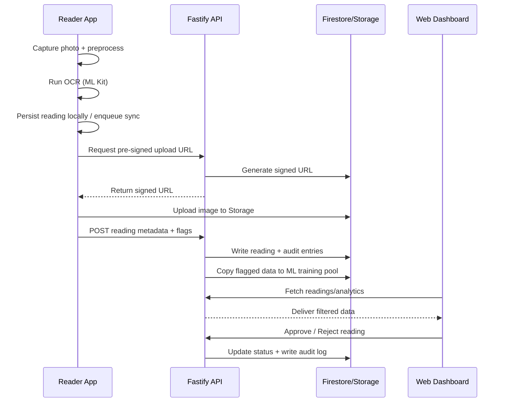

```mermaid
sequenceDiagram
    participant ReaderApp as Reader App
    participant Backend as Fastify API
    participant Firestore as Firestore/Storage
    participant Dashboard as Web Dashboard

    ReaderApp->>ReaderApp: Capture photo + preprocess
    ReaderApp->>ReaderApp: Run OCR (ML Kit)
    ReaderApp->>ReaderApp: Persist reading locally / enqueue sync
    ReaderApp->>Backend: Request pre-signed upload URL
    Backend->>Firestore: Generate signed URL
    Backend-->>ReaderApp: Return signed URL
    ReaderApp->>Firestore: Upload image to Storage
    ReaderApp->>Backend: POST reading metadata + flags
    Backend->>Firestore: Write reading + audit entries
    Backend->>Firestore: Copy flagged data to ML training pool
    Dashboard->>Backend: Fetch readings/analytics
    Backend-->>Dashboard: Deliver filtered data
    Dashboard->>Backend: Approve / Reject reading
    Backend->>Firestore: Update status + write audit log
```

